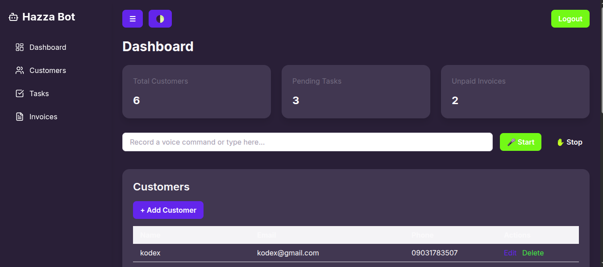

# Freelancer Customer Management System

A simple and powerful Customer Management System (CMS) built for freelancers to manage clients, invoices, and reminders — all in one place.

## 🚀 Features

- ✅ **Add & Manage Customers**  
- ✅ **Create & Track Invoices**  
- ✅ **Send Reminders to Clients**
- ✅ **Voice Command Support** (for hands-free control)
- ✅ **Secure Authentication** (for the freelancer only)

## 📸 Screenshots

### Dashboard View


### Add Customer


## 🛠️ Built With

- **Laravel** (PHP Framework)
- **Blade** (Templating engine)
- **MySQL** (Database)
- **Tailwind CSS / Bootstrap** 
- **JavaScript / Web APIs** (for voice command)

## ⚙️ Getting Started

### 1. Clone the repository

```bash
git clone https://github.com/Osinemem1/freelancer-crm.git
cd freelancer-crm
